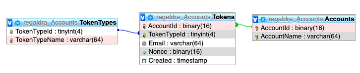

# Accounts

Setup a simple full-stack PHP & MySQL website that allows you to create and manage accounts password, email, and 2FA.

- Create account for user name and email
- Reduce spam accounts via CAPTCHA
- Verify email
- Email template
- Validate alpha-numeric account name between 3-64 characters
- Validate email up to 64 characters
- Validate password 8-64 characters with upper case, lower case, symbol, and number
- Prevent using same password as prior 5 passwords
- Salt and hash passwords
- Change email only after new email is verified
- Resend verification email
- Reset password
- Add & Remove two-factor authentication
- Enforce old passwords to change
- Localization (nice to have...)

## Structure
- **ui**: The front-end code that talks to the api.
- **api**: The back-end code to talk to the MySQL database.
    - Tested on MySQL `@@version` 5.6.41-84.1
    - All communication is via JSON.
    - JSON Object always has `success` key to indicate if there was a problem.
    - JSON Errors will always have a `message` key to explain the reason
    - JSON Success will have a `data` key containing any data returned
- **api/test**: simple manual tests against api
- **api/chron**: cron jobs to clean up the database for failed password resets and email verification
- **db/build**: database scripts to run in the order listed
  - named with unix timestamps to list in proper order of execution
  - format `[timestamp]-[TABLE|FUNC|PROC]-[name].sql`
  - Document table, columns, and indexes

## Database
The database is a normalized MySQL database.

