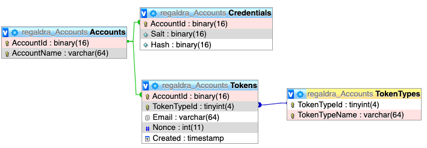

# Accounts

Setup a simple website that allows you to create and manage accounts password, email, and 2FA.

- Create account for user name and email
- Verify email before asking to associate a password
- Associate a password after verifying email
- Change email only after new email is verified
- Reset password
- Add & Remove two-factor authentication

## Structure
- **ui**: The front-end code that talks to the api.
- **api**: The back-end code to talk to the database. All communication is via JSON.
- **api/chron**: cron jobs to clean up the database for failed password resets and email verification
- **db/build**: database scripts to run in the order specified, prefixed with unix timestamps

## Database
The database is a normalized MySQL database.
